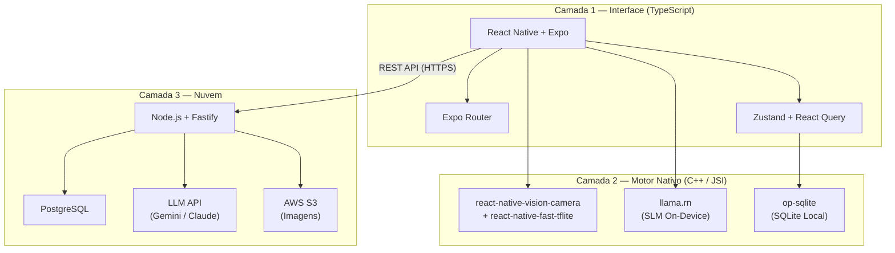
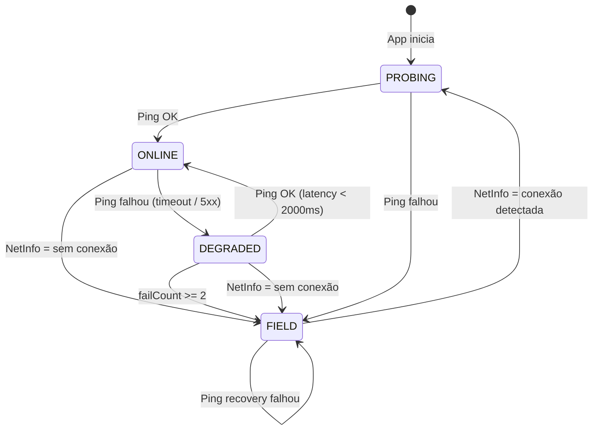

## 1. A Camada de Interface (Onde você programa)

Toda a parte visual, telas, botões e navegação será escrita em **TypeScript** com React Native.

- **O Framework:** **Expo** (usando a funcionalidade _Expo Prebuild_ / _Custom Dev Client_). Esqueça o trauma de configurar o Xcode para iOS e o Android Studio manualmente. O Expo gerencia as pastas nativas para você.
    
- **Navegação:** **Expo Router**, a solução moderna baseada em arquivos que facilita o gerenciamento de rotas e suporta "Deep Linking" nativamente, substituindo o tradicional React Navigation.

- **Gerenciamento de Estado Offline:** Para lidar com a fila de fotos e diagnósticos que precisam ser enviados quando a internet voltar (o RF05 de _Store and Forward_), uma biblioteca como **Zustand** aliada ao **React Query** com persistência no SQLite é a combinação mais eficiente.
    > [!NOTE]
    > **Escopo MVP vs v2:** No MVP, o envio da fila ocorrerá via **Ação Manual** (botão de sincronizar). O envio 100% invisível em *background fetch* fica reservado para a **v2**.

## 2. A Camada Nativa de IA e Dados (O "Motor" em C++)

Esta é a parte que vai rodar por baixo dos panos, conectada diretamente ao hardware do celular via JSI, sem engasgar a interface.

- **Visão Computacional (Tempo Real):** Para o MVP, usaremos um modelo customizado treinado no **Azure Custom Vision**, exportado nos formatos **CoreML** (para iOS) e **TensorFlow Lite** (para Android). O processamento visual utilizará **`react-native-vision-camera`** combinado com **`react-native-fast-tflite`**, permitindo inferência em tempo real via Frame Processors diretamente no fluxo de vídeo, antes mesmo da foto ser capturada.
    
- **A SLM (A IA de Conversa Local):** **`llama.rn`** (que encapsula o `llama.cpp` para React Native). Ele permite rodar os arquivos quantizados `.gguf` (Gemma ou Llama) tirando o máximo de proveito da memória RAM unificada dos celulares modernos, sendo o padrão-ouro da indústria para esse fim.

- **O Banco de Dados Local:** **`op-sqlite`**. O `op-sqlite` é o sucessor moderno do `react-native-quick-sqlite`, suportando a Nova Arquitetura do React Native e acessando o armazenamento via JSI na velocidade nativa. A extensão `sqlite-vec` (para RAG offline) está listada na arquitetura, mas seu uso é exclusivo da **v2**.

### 2.1 Diretrizes de Performance da SLM (MVP)
Para evitar que a SLM on-device degrade a experiência do usuário (UX), a implementação do `llama.rn` deve obrigatoriamente respeitar as seguintes regras:
1. **Carregamento Assíncrono Just-In-Time (JIT):** O modelo `.gguf` deve ser carregado na RAM apenas quando o usuário navegar para a tela de Chat. Para evitar a sensação de "app travado", a interface deve exibir imediatamente um indicador visual honesto com uma barra de progresso (ex: *"Preparando o Agrônomo Virtual..."*). Essa abordagem poupa a memória RAM do celular caso o produtor queira apenas usar a câmera, mantendo uma experiência transparente.
2. **Isolamento de Thread:** A inferência (processo de gerar a resposta) **nunca** pode rodar na *UI Thread* do React Native. Deve ser delegada estritamente para uma *Background Thread* / *Worker* via JSI, garantindo que o app continue responsivo e permitindo que o usuário cancele a ação ou navegue para outra tela.
3. **Timeout e Feedback Visual:** Deve existir um *timeout* lógico rigoroso. Se a inferência local demorar mais do que *X segundos* (ex: 10 segundos) devido a um hardware muito fraco (Thermal Throttling), a interface deve mostrar um feedback visual amigável (ex: *"O diagnóstico está demorando mais que o normal, mas continuo analisando..."*) e permitir que o usuário aborte a operação.

### 2.2 Especificação do Modelo SLM (MVP)

A escolha do modelo SLM para o MVP deve equilibrar **qualidade de resposta** e **viabilidade de hardware** em aparelhos intermediários. A definição final será validada por benchmarks reais em dispositivos-alvo, mas a arquitetura deve ser projetada considerando os seguintes parâmetros de referência:

| Parâmetro | Especificação de Referência |
|---|---|
| **Candidatos Primários** | Gemma 2 2B, Llama 3.2 1B ou Llama 3.2 3B |
| **Formato do Arquivo** | `.gguf` (compatível com `llama.cpp` / `llama.rn`) |
| **Quantização Recomendada** | `Q4_K_M` (melhor relação qualidade/tamanho para mobile) |
| **Tamanho Estimado em Disco** | ~1.0GB (2B Q4) a ~1.5GB (3B Q4) |
| **RAM Estimada em Operação** | ~1.5GB (2B) a ~2.0GB (3B) |
| **Dispositivo Mínimo Viável** | 4GB de RAM total (para 2B) ou 6GB de RAM total (para 3B) |
| **Distribuição (MVP)** | Embarcado no binário do app via Play Asset Delivery (Android) / On-Demand Resources (iOS) |

> [!NOTE]
> **Modelos embarcados no MVP:** Os arquivos `.gguf` (SLM) e `.tflite`/`.mlmodel` (CV) são distribuídos dentro do próprio pacote do aplicativo. Isso aumenta o tamanho do instalador (~1.5-2GB), mas elimina a complexidade de download OTA e garante que o app funcione 100% offline desde a primeira abertura. A migração para distribuição OTA com download seletivo por tier de hardware é escopo da **v2**.

> [!WARNING]
> **Decisão pendente:** A escolha final entre Gemma 2B e Llama 3.2 3B deve ser feita após testes de benchmark no hardware-alvo, avaliando: (1) qualidade das respostas agronômicas em português, (2) tempo de inferência (tokens/segundo), e (3) estabilidade térmica após uso prolongado. Modelos sub-1B (como Llama 3.2 1B) podem ser considerados apenas se os candidatos maiores forem inviáveis no hardware mínimo.

### 2.3 Módulo de Network Sensing (RF04) — Especificação Completa

Para implementar o failover automático entre LLM em nuvem e SLM local, o app deve conter um módulo dedicado de detecção de conectividade operando de forma **event-driven** (não por polling contínuo, que consumiria bateria).

**Biblioteca Base:** **`@react-native-community/netinfo`** — fornece listeners nativos do SO para mudanças de estado de rede (Wi-Fi, 4G/5G, sem conexão) sem polling, consumindo energia mínima.

#### 2.3.1 Máquina de Estados (3 Estados)

O módulo opera com **3 estados**. O estado intermediário `DEGRADED` evita oscilação (flip-flop) quando o sinal está fraco e cria uma **janela para pré-carregar a SLM** antes de precisar dela.



| Estado | Pipeline de IA | Indicador Visual | Ação sobre a SLM |
|---|---|---|---|
| `PROBING` | Nenhum (aguardando, máx 2s) | Spinner / "Verificando conexão..." | — |
| `ONLINE` | ☁️ LLM em Nuvem | Nenhum (padrão) | SLM **descarregada** da RAM |
| `DEGRADED` | ☁️ LLM em Nuvem (tenta primeiro, fallback SLM) | ⚠️ "Conexão instável" | SLM **pré-carregada** em background |
| `FIELD` | 📱 SLM Local | 🌾 "Modo Campo" | SLM **carregada e pronta** |

> [!TIP]
> **O grande insight do `DEGRADED`:** ele nos dá uma janela de tempo para carregar o modelo `.gguf` na RAM (~3-5 segundos) **antes** de realmente precisar dele. Quando o failover para FIELD ocorrer, a resposta é instantânea em vez de mostrar "Preparando o Agrônomo Virtual..." por 5 segundos.

**Decisões de Design:**
- **Chat no `DEGRADED`:** O app tenta a nuvem primeiro e cai para SLM apenas se a chamada falhar (prioriza qualidade).
- **Diagnóstico por câmera no `DEGRADED`:** A recomendação de tratamento (RF02) usa **apenas o SQLite local** — não tenta buscar dados frescos da API (Delta Sync já mantém o catálogo atualizado).
- **Transições:** Feedback apenas via toast visual (silencioso, sem vibração).
- **Recovery:** Automático — quando o ping volta a funcionar, o app retorna para ONLINE sem intervenção do produtor.

#### 2.3.2 Thresholds e Constantes

Todas as constantes são centralizadas em um único arquivo de configuração para facilitar tuning em campo.

```typescript
// config/network.ts
export const NETWORK_CONFIG = {
  // ---- Health Check ----
  HEALTH_CHECK_URL: '/api/v1/health',
  HEALTH_CHECK_TIMEOUT_MS: 2_000,     // Timeout do ping (RF04: 2000ms)

  // ---- Thresholds de Transição ----
  MAX_CONSECUTIVE_FAILURES: 2,         // Falhas consecutivas para DEGRADED → FIELD
  LATENCY_WARN_MS: 1_500,             // Acima disso: log de warning (mas não muda estado)
  LATENCY_FAIL_MS: 2_000,             // Acima disso: contabiliza como falha

  // ---- Debounce / Hysteresis ----
  DEBOUNCE_TO_FIELD_MS: 3_000,        // Espera antes de confirmar DEGRADED → FIELD
  DEBOUNCE_TO_ONLINE_MS: 0,           // FIELD → ONLINE é imediato

  // ---- Recovery (quando em FIELD) ----
  RECOVERY_INITIAL_DELAY_MS: 30_000,  // Primeira tentativa de recovery: 30s
  RECOVERY_MAX_DELAY_MS: 300_000,     // Teto do backoff: 5 minutos
  RECOVERY_BACKOFF_FACTOR: 2,         // Multiplicador exponencial

  // ---- Request-Level Fallback ----
  REQUEST_TIMEOUT_MS: 10_000,         // Timeout para chamadas reais à API (chat/stream)
  IMMEDIATE_FALLBACK_CODES: [502, 503, 504],
} as const;
```

#### 2.3.3 Árvore de Decisão Completa

**Camada 1 — Detecção Passiva (NetInfo)**
Event-driven, consome zero bateria. O SO notifica mudanças automaticamente.

```plaintext
NetInfo.addEventListener(state => ...)

state.isConnected === false
  └──> Transição imediata para FIELD

state.isConnected === true  AND  estado_atual === FIELD
  └──> Transição para PROBING (validar se o servidor responde)

state.isConnected === true  AND  estado_atual === ONLINE
  └──> Nada (já está online)
```

**Camada 2 — Validação Ativa (Health Check)**
Disparada apenas em transições de estado ou para confirmar conectividade.

```plaintext
GET /api/v1/health (timeout: 2000ms)

CASO 1 — HTTP 200 + latência < 2000ms:
  ├── PROBING   → ONLINE
  ├── DEGRADED  → ONLINE (reset failCount = 0)
  └── Registrar latency_ms para telemetria

CASO 2 — Timeout (>= 2000ms):
  ├── ONLINE    → failCount++ → DEGRADED
  ├── DEGRADED  → failCount++
  │     └── failCount >= 2 → FIELD (com debounce de 3s)
  └── PROBING   → FIELD

CASO 3 — HTTP 5xx:
  └── Transição imediata para FIELD

CASO 4 — Erro de rede (DNS failure, connection refused):
  └── Transição imediata para FIELD
```

**Camada 3 — Fallback por Requisição (tempo real)**
Captura falhas em chamadas reais à API, mesmo estando em `ONLINE`.

```plaintext
Chamada à API (ex: POST /api/v1/chat/stream) falhou:

SE timeout (> 10s) OU HTTP 502/503/504:
  ├── Disparar a mesma mensagem para a SLM local (fallback transparente)
  ├── Exibir toast: "Conexão instável, usando IA local"
  └── Disparar health check em background → possível transição para FIELD

SE HTTP 401: Disparar refresh de token (NÃO é failover de rede)
SE HTTP 429: Aguardar Retry-After (NÃO ativar fallback)
```

> [!WARNING]
> **O fallback por requisição é o mais importante para a UX.** O produtor não sabe (nem deveria saber) o que é um "health check". Se o chat demorar mais de 10 segundos sem nenhum token SSE, a SLM local deve assumir silenciosamente.

#### 2.3.4 Recovery — Backoff Exponencial

Quando em `FIELD`, o app tenta periodicamente reconectar sem destruir a bateria:

```plaintext
Tentativa    Delay        Tempo acumulado
────────────────────────────────────────
   1ª        30 seg       0:30
   2ª        60 seg       1:30
   3ª        120 seg      3:30
   4ª        240 seg      7:30
   5ª+       300 seg      (teto: a cada 5 min)
```

**Reset do backoff** (contador volta a zero) quando:
- O `NetInfo` reporta uma mudança de tipo de rede (ex: 4G → Wi-Fi)
- O health check retorna sucesso
- O app volta do background (o produtor pode ter se movido para uma área com sinal)

#### 2.3.5 Cenário Real Completo

```plaintext
09:00 — Produtor abre o app na sede (Wi-Fi forte)
         NetInfo: connected = true, type = wifi
         Ping /health: 120ms ✓
         Estado: ONLINE ☁️

09:15 — Sai para o campo de carro
         NetInfo: type muda para cellular (4G)
         Ping /health: 890ms ✓
         Estado: ONLINE ☁️ (continua)

09:45 — Sinal enfraquece na divisa do talhão
         Ping /health: TIMEOUT (>2000ms)
         failCount = 1 → Estado: DEGRADED ⚠️
         >>> SLM começa a carregar em background <<<

09:45:05 — Segundo ping automático
         Ping /health: TIMEOUT (>2000ms)
         failCount = 2 → debounce 3s iniciado

09:45:08 — Debounce completo
         Estado: FIELD 🌾 (SLM já está pronta!)
         Toast: "Modo Campo ativado"
         >>> Contexto da conversa LLM transferido para SLM <<<

10:30 — Produtor se move para outra área com sinal
         NetInfo: tipo muda (reconectou)
         Recovery ping: 450ms ✓
         Estado: ONLINE ☁️ (automático)
         Toast: "Conexão restabelecida"
         >>> Contexto da conversa SLM transferido para LLM <<<
```

### 2.4 Protocolo de Handoff de Contexto (LLM ↔ SLM)

Quando o modo muda durante uma conversa ativa, o contexto (histórico de mensagens) deve ser transferido de forma transparente para que o produtor não precise repetir sua pergunta. O front-end mantém um **histórico unificado** em um único formato, independentemente de qual IA respondeu.

#### 2.4.1 Formato Unificado de Histórico

O Zustand mantém um array único de mensagens para toda a sessão de chat:

```typescript
type ChatMessage = {
  role: 'user' | 'assistant' | 'system';
  content: string;
  source: 'CLOUD_LLM' | 'LOCAL_SLM'; // Quem gerou a resposta
  timestamp: string;
};

// Estado global (Zustand)
type ChatState = {
  sessionId: string;
  history: ChatMessage[];
  connectionMode: 'ONLINE' | 'DEGRADED' | 'FIELD';
};
```

O campo `source` registra qual IA gerou cada resposta, mas **não é enviado** para nenhuma das IAs — serve apenas para telemetria e UX (ex: exibir um badge discreto em cada mensagem indicando se foi nuvem ou local).

#### 2.4.2 Transição ONLINE → FIELD (LLM → SLM)

Quando o failover para SLM é ativado durante uma conversa ativa:

```plaintext
1. O front-end já possui o array `history` completo (gerenciado localmente)

2. Injetar uma mensagem de sistema invisível no histórico:
   { role: "system", content: "A partir deste ponto, você está
     operando no modo offline. Use apenas as informações do
     contexto fornecido.", source: "LOCAL_SLM" }

3. Condensar o histórico para caber na janela de contexto da SLM:
   - Manter as últimas 10 mensagens (em vez de 20 do LLM)
   - Se o contexto de doença/defensivo existir, priorizar mantê-lo

4. Montar o prompt da SLM com:
   [System Prompt local] + [Contexto SQLite] + [Histórico condensado]

5. A próxima mensagem do produtor vai direto para o llama.rn
```

> [!NOTE]
> **Janela de contexto menor:** A SLM (2-3B parâmetros) possui uma janela de contexto muito menor que o LLM de nuvem. Por isso o histórico é condensado de 20 para **10 mensagens** na transição. A qualidade das respostas antigas importa menos que a coerência das recentes.

#### 2.4.3 Transição FIELD → ONLINE (SLM → LLM)

Quando a conexão é restabelecida durante uma conversa ativa:

```plaintext
1. O front-end já possui o array `history` completo
   (inclui as mensagens geradas pela SLM, marcadas com source: "LOCAL_SLM")

2. Na próxima chamada POST /api/v1/chat/stream, enviar o
   histórico completo (até 20 mensagens) no campo `history`

3. Injetar no contexto uma nota para o LLM de nuvem:
   "Algumas das respostas anteriores foram geradas por um
    modelo local compacto durante operação offline. Você pode
    corrigir ou complementar informações se necessário."

4. O LLM de nuvem recebe o contexto completo e continua
   a conversa com qualidade superior, podendo refinar respostas
   anteriores da SLM se o produtor pedir
```

#### 2.4.4 Considerações de Implementação

| Aspecto | Decisão |
|---|---|
| **Quem gerencia o histórico?** | O front-end (Zustand), como definido na seção 6.4 do Node.js. O back-end é stateless. |
| **Limite de mensagens** | 20 mensagens para LLM de nuvem, 10 mensagens para SLM local (sliding window) |
| **Persistência local** | O histórico da sessão ativa é mantido em memória (Zustand). Se o app for fechado, perde-se (limitação aceita no MVP). |
| **Mensagens do sistema** | Inseridas apenas no prompt, **não exibidas** na interface do produtor. |
| **Indicador visual** | Cada mensagem do chat exibe um badge discreto: ☁️ (nuvem) ou 📱 (local), permitindo ao produtor saber qual IA respondeu. |

## 3. A Camada de Nuvem (O seu Back-end)

Esta camada fica nos seus servidores e se comunica com o app via REST API.

- **O Servidor:** **Node.js** (utilizando **Fastify** para alta performance e suporte otimizado a Streams).
    
- **O Banco de Dados Principal:** **PostgreSQL** com a extensão `pgvector` (ativada na v2). Ele guarda todos os dados dos usuários, todas as bulas, e serve como a "fonte da verdade" que o SQLite do celular vai copiar.
    
- **O LLM Principal:** Integração com as APIs da Anthropic (Claude) ou Google (Gemini) para atuar como o Agrônomo Profissional quando houver internet.

- **Armazenamento de Imagens:** **AWS S3** para armazenar as fotos dos diagnósticos enviadas via *Store and Forward*. O acesso às imagens é controlado exclusivamente por **Signed URLs** com expiração curta (15 minutos), nunca por URLs públicas.
    

## 4. Os Fluxos da Arquitetura em Ação

### 4.1 Fluxo A — Diagnóstico por Câmera (RF01 + RF02)

1. O usuário (no Android ou iOS) aponta a câmera. O fluxo de vídeo nativo é processado em tempo real pelo **`react-native-vision-camera`**.
    
2. O Frame Processor executa o modelo do **Custom Vision (CoreML ou TFLite)** em milissegundos via **`react-native-fast-tflite`** e já identifica a doença.
    
3. O app busca na tabela `doencas` e `defensivos` (SQLite) os dados textuais estruturados relacionados àquela doença detectada (nome, sintomas, defensivos indicados, dosagens e carência).

4. A interface exibe o resultado do diagnóstico com o nível de confiança da IA, as opções de tratamento e o **disclaimer legal** (RF02). Os botões de feedback (RF06) são apresentados logo abaixo.

5. A foto, os metadados do diagnóstico e a geolocalização são salvos na `fila_diagnosticos` do SQLite com status `PENDING` para sincronização futura.

### 4.2 Fluxo B — Chat Online (RF03 + RF04, Modo Online)

1. O usuário abre a tela de Chat. O módulo de **Network Sensing** (seção 2.3) confirma que a conexão está estável (`connectionMode: ONLINE`).

2. O app envia a mensagem via `POST /api/v1/chat/stream` com o contexto do último diagnóstico (se houver) e o histórico da conversa.

3. O Node.js consulta as tabelas relacionais do PostgreSQL (doenças, defensivos, dosagens) para montar o contexto técnico e injeta tudo no System Prompt do LLM de nuvem.

4. A resposta é transmitida em tempo real via **Server-Sent Events (SSE)**, renderizando token por token na interface do React Native (efeito "digitando").

### 4.3 Fluxo C — Chat Offline (RF03 + RF04, Modo Campo)

1. O módulo de **Network Sensing** detecta ausência de conexão ou latência acima de 2000ms. A interface exibe o indicador visual de **"Modo Campo"**.

2. O usuário abre a tela de Chat. O **`llama.rn`** inicia o carregamento do modelo `.gguf` na RAM (carregamento JIT — seção 2.1). A interface exibe *"Preparando o Agrônomo Virtual..."* com barra de progresso.

3. O app executa um `SELECT` no SQLite para buscar os dados estruturados relevantes (doença detectada, defensivos associados, dosagens) e os injeta como contexto textual no prompt da SLM.

4. A SLM gera a resposta em uma **Background Thread** (via JSI). A interface renderiza a saída de forma progressiva. Toda a sessão (prompts, respostas e latência) é salva na `fila_slm_logs` do SQLite para sincronização e auditoria futura.

    > [!NOTE]
    > Na **v2**, esse processo offline será substituído por um motor RAG real: a pergunta será vetorizada nativamente e o `sqlite-vec` fará uma busca de similaridade semântica para encontrar os parágrafos mais relevantes antes de acionar a SLM.

Essa arquitetura garante que o aplicativo tenha a fluidez de um app nativo de iOS ou Android, mas com a manutenibilidade de uma base de código única em JavaScript/TypeScript.


