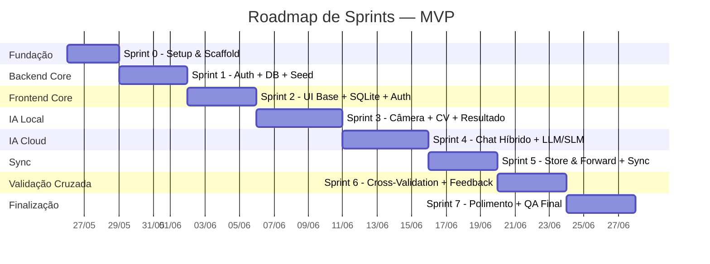

# Plano de Implementação (Sprints)

> [!IMPORTANT]
> Este plano divide o desenvolvimento do MVP em **8 sprints** com checkpoints de qualidade entre cada uma. Nenhum código avança para a próxima sprint sem que os testes da sprint atual estejam passando.

**Documentos relacionados:**
- [[Documento de Requisitos do MVP]]
- [[Arquitetura do App (MVP)]]
- [[Contratos de API]]
- [[A Arquitetura do Node.js]]
- [[A Arquitetura do PostgreSQL]]
- [[A Arquitetura do SQLite]]
- [[Infraestrutura e Deploy]]
- [[Estratégia de Cross-Validation Visual]]
- [[Fonte de Dados e Curadoria do Catálogo]]

---

## Visão Geral



**Duração estimada total: ~33 dias úteis (~7 semanas)**

---

## Decisões de Infraestrutura ✅

| # | Decisão | Resposta |
|---|---|---|
| 1 | **Estrutura do Repositório** | ✅ **Monorepo** — pasta raiz com `/frontend` e `/backend`, tipos TypeScript compartilhados |
| 2 | **Chaves de API** | ✅ **Mock até Sprint 4** — integrações externas (S3, Gemini/Claude) mockadas; chaves reais a partir da Sprint 4 (Chat) |
| 3 | **Localização do Código** | ✅ **Pasta separada**: `/home/lucas/Documentos/Projetos/AppDiagnostico` |
| 4 | **Modelo de CV** | ✅ Modelo `.tflite` / `.mlmodel` **já treinado** — não incluir treinamento no escopo |
| 5 | **Modelo SLM** | ✅ **Benchmark Gemma 2B vs Llama 3.2 3B** na Sprint 4 — decidir após teste real no device |
| 6 | **Duração** | ✅ **33 dias (~7 semanas)** full-time conforme planejado |

---

## Sprint 0 — Fundação e Scaffold (3 dias)

**Objetivo:** Sair do zero. Projetos criados, rodando localmente, com "Hello World" funcionando em ambas as pontas.

### Entregas

#### Backend (Node.js / Fastify)
- [ ] Inicializar projeto TypeScript com Fastify
- [ ] Instalar dependências: `fastify`, `drizzle-orm`, `drizzle-kit`, `pg`, `zod`, `pino`
- [ ] Configurar estrutura de pastas modular: `modules/`, `shared/`, `config/`
- [ ] Configurar Zod schema para variáveis de ambiente (`config/env.ts`)
- [ ] Criar rota `GET /api/v1/health` retornando `{ status: "ok", timestamp }`
- [ ] Configurar ESLint + Prettier + `tsconfig.json`

#### Frontend (React Native / Expo)
- [ ] Inicializar projeto Expo com TypeScript (Expo Prebuild / Custom Dev Client)
- [ ] Configurar Expo Router (file-based routing)
- [ ] Instalar dependências base: `zustand`, `op-sqlite`, `@react-native-community/netinfo`
- [ ] Criar estrutura de pastas: `/app`, `/components`, `/db`, `/store`, `/config`, `/lib`
- [ ] Criar tela placeholder "Hello World" com tipografia e cores do Design System
- [ ] Configurar ESLint + Prettier

#### Infraestrutura
- [ ] Criar `docker-compose.yml`: PostgreSQL 16 (Alpine) + volume `pgdata`
- [ ] Criar `Dockerfile` multi-stage para o backend (node:20-alpine)
- [ ] Criar `.env.example` com todas as variáveis documentadas
- [ ] Inicializar repositório Git com `.gitignore` adequado

### 🧪 Gate de Qualidade — Sprint 0

| # | Teste | Critério de Aceite |
|---|---|---|
| T0.1 | Build TypeScript (backend) | `tsc --noEmit` passa sem erros |
| T0.2 | Health Check | `curl localhost:3000/api/v1/health` retorna 200 + JSON |
| T0.3 | PostgreSQL local | `docker compose up` sobe o banco sem erros |
| T0.4 | Frontend build | `npx expo start` compila e renderiza a tela placeholder |
| T0.5 | Lint | `npm run lint` passa em ambos os projetos |

---

## Sprint 1 — Backend: Auth + Database + Seed (4 dias)

**Objetivo:** Banco de dados completo, sistema de autenticação funcional, e dados de seed carregados.

### Entregas

#### PostgreSQL Schema (Drizzle ORM)

> Referência: [[A Arquitetura do PostgreSQL]]

- [ ] Criar schema completo com Drizzle: todas as 11 tabelas
  - Auth: `usuarios`, `refresh_tokens`
  - Domínio: `culturas`, `doencas`, `defensivos`, `doenca_defensivo`
  - Telemetria: `diagnosticos`, `feedbacks_diagnostico`, `sessoes_slm`, `interacoes_slm`
  - [v2 placeholder]: `documentos_rag` (criada mas vazia)
- [ ] Criar os 12 índices documentados (FK, UNIQUE, `updated_at`)
- [ ] Gerar e rodar as migrations via Drizzle Kit (`npm run db:migrate`)

#### Módulo de Autenticação

> Referência: [[A Arquitetura do Node.js]] e [[Contratos de API]]

- [ ] `POST /api/v1/auth/register` — Validação Zod (nome 2-100, email único, senha ≥8)
- [ ] `POST /api/v1/auth/login` — Argon2id verify + JWT (HS256, 15min) + Refresh Token (30 dias)
- [ ] `POST /api/v1/auth/refresh` — Rotação de tokens + detecção de reutilização (revoga TODOS se token reusado)
- [ ] `POST /api/v1/auth/logout` — Revoga refresh token no banco
- [ ] Middleware `authenticate` — Extrai `user_id` do JWT, injeta no `request`
- [ ] Proteção contra enumeração de usuários (mensagens genéricas no 401)

#### Seed de Dados

> Referência: [[Fonte de Dados e Curadoria do Catálogo]]

- [ ] Script `npm run seed` que carrega os 3 JSONs curados:
  - `doencas.json` (15 doenças)
  - `defensivos.json` (10 defensivos)
  - `doenca_defensivo.json` (26 relações)
- [ ] Criar registro da cultura "Soja" em `culturas`
- [ ] Usar `onConflictDoNothing()` para idempotência (rodar seed múltiplas vezes sem duplicar)

#### Infraestrutura
- [ ] Middleware de tratamento de erros padronizado: `{ error: { code, message, details } }`
- [ ] Rate limiting por categoria (auth: 10/min, geral: 60/min)
- [ ] Logger Pino configurado (JSON structured, request_id)

### 🧪 Gate de Qualidade — Sprint 1

| # | Teste | Critério de Aceite |
|---|---|---|
| T1.1 | Migrations | `npm run db:migrate` executa sem erros no PostgreSQL local |
| T1.2 | Seed | `npm run seed` carrega todos os dados; query retorna 15 doenças e 26 relações |
| T1.3 | Register | POST válido retorna 201; email duplicado retorna 409 |
| T1.4 | Login | Credenciais corretas retornam `access_token` + `refresh_token`; incorretas retornam 401 genérico |
| T1.5 | Refresh | Token válido gera novo par; token reusado revoga todas as sessões do usuário |
| T1.6 | Protected Route | Request sem JWT retorna 401; com JWT válido retorna 200 |
| T1.7 | Rate Limiting | 11ª request em 1min para `/auth/*` retorna 429 com header `Retry-After` |
| T1.8 | Testes unitários | Vitest: ≥80% de cobertura no módulo de auth |

---

## Sprint 2 — Frontend: UI Base + SQLite + Auth (4 dias)

**Objetivo:** Design System aplicado, banco local funcional, e fluxo de login/registro completo conectado ao backend.

### Entregas

#### Design System
- [ ] Definir tokens visuais: paleta de cores (modo escuro agrícola), espaçamentos, bordas, sombras
- [ ] Tipografia: fonte Inter ou Outfit (Google Fonts)
- [ ] Componentes reutilizáveis: `Button`, `Input`, `Card`, `Badge`, `Toast`, `StatusBar`
- [ ] Componente `ConnectionIndicator` (ONLINE/DEGRADED/FIELD) — visual sem lógica ainda

#### SQLite (op-sqlite)

> Referência: [[A Arquitetura do SQLite]]

- [ ] Configurar op-sqlite com flag `useSQLCipher: true`
- [ ] Criar migration script local (DDL) para as 7 tabelas:
  - Domínio: `culturas`, `doencas`, `defensivos`, `doenca_defensivo`
  - Filas: `fila_diagnosticos`, `fila_feedbacks`, `fila_slm_logs`
- [ ] Usar `PRAGMA user_version` para controle de versão do schema
- [ ] Carregar dados do catálogo hardcoded (JSON local) como seed inicial (antes do Delta Sync existir)

#### Autenticação (Frontend)
- [ ] Tela de **Login** (email + senha) com validação e estados de loading/erro
- [ ] Tela de **Registro** (nome + email + senha) com feedback visual
- [ ] Zustand store de auth (`useAuthStore`) com `access_token`, `refresh_token`, `user`
- [ ] Armazenamento seguro: Keychain (iOS) / EncryptedSharedPreferences (Android)
- [ ] Interceptor HTTP para injeção automática do Bearer token
- [ ] Lógica de refresh automático no 401 (retry transparente)
- [ ] Redirecionamento: usuário não autenticado → Login; autenticado → Home

#### Network Sensing

> Referência: [[Arquitetura do App (MVP)]] — Seção 2.3 (Network Sensing)

- [ ] Implementar state machine de conectividade com `@react-native-community/netinfo`:
  - Estados: `PROBING` → `ONLINE` → `DEGRADED` → `FIELD`
  - Health check: `GET /api/v1/health` com timeout 2000ms
  - `MAX_CONSECUTIVE_FAILURES`: 2 antes de DEGRADED → FIELD
  - Debounce: 3000ms antes de confirmar transição
  - Recovery: exponential backoff (30s → 5min), reset em mudança de tipo de rede
- [ ] Zustand store de rede (`useNetworkStore`)
- [ ] Componente `ConnectionIndicator` conectado à store (agora com lógica real)

### 🧪 Gate de Qualidade — Sprint 2

| # | Teste | Critério de Aceite |
|---|---|---|
| T2.1 | SQLite init | App abre sem crash; `PRAGMA user_version` retorna versão correta |
| T2.2 | Catálogo local | Query `SELECT * FROM doencas` retorna 15 registros no dispositivo |
| T2.3 | Registro | Criar conta pelo app → usuário criado no PostgreSQL |
| T2.4 | Login | Login com credenciais válidas → navega para Home; inválidas → mensagem de erro |
| T2.5 | Token refresh | Simular expiração do access_token → refresh automático sem logout |
| T2.6 | Secure storage | Tokens armazenados no Keychain/EncryptedPrefs (inspecionar via debug) |
| T2.7 | Network sensing | Desligar Wi-Fi → estado muda para FIELD + "Modo Campo 🌾" aparece; religar → volta para ONLINE |
| T2.8 | Design system | Todos os componentes base renderizam corretamente em iOS e Android |

---

## Sprint 3 — Câmera + Visão Computacional + Resultado (5 dias)

**Objetivo:** O fluxo principal do app — apontar a câmera, identificar a doença, e ver as recomendações de tratamento.

### Entregas

#### Câmera e Inferência

> Referência: [[Arquitetura do App (MVP)]] — Fluxo A (Diagnóstico Visual)

- [ ] Integrar `react-native-vision-camera` com permissões de câmera
- [ ] Integrar `react-native-fast-tflite` para inferência com Frame Processors
- [ ] Carregar modelo TFLite (Android) / CoreML (iOS) no boot da tela
- [ ] Executar inferência em tempo real (~50ms target)
- [ ] Suporte à captura de imagem da galeria (alternativa à câmera)
- [ ] Salvar imagem capturada no diretório persistente (NÃO cache)

#### Tela de Resultado do Diagnóstico
- [ ] **Card de Resultado**: nome da doença, nome científico, nível de severidade, confiança (%)
- [ ] **Seção de Sintomas**: texto rico do campo `sintomas` da tabela `doencas`
- [ ] **Seção de Tratamento**: lista de defensivos com:
  - Nome comercial, ingrediente ativo, classe
  - Dosagem recomendada, carência (dias), máx. aplicações
  - Bula resumida (modo de ação, época, EPIs)
  - **Disclaimer legal** obrigatório (Lei 7.802/1989)
- [ ] **Tela especial "Saudável"**: mensagem "Nenhuma doença detectada" (tag não vem do banco)
- [ ] **Tela especial "Fitotoxicidade"**: mensagem de dano abiótico + indicação de agrônomo (sem defensivos)

#### Armazenamento Local
- [ ] Salvar diagnóstico na `fila_diagnosticos` com status `PENDING`
- [ ] Registrar metadados: `doenca_id`, `confianca_ia`, `modelo_usado`, `tempo_inferencia_ms`, `latitude`, `longitude`
- [ ] Gerar `local_id` (UUID) para cada diagnóstico

### 🧪 Gate de Qualidade — Sprint 3

| # | Teste | Critério de Aceite |
|---|---|---|
| T3.1 | Câmera | Permissão solicitada ao abrir; viewfinder funcional em iOS e Android |
| T3.2 | Inferência local | Modelo carrega sem crash; inferência retorna resultado em ≤500ms (RNF04) |
| T3.3 | Resultado correto | Foto de ferrugem asiática → card mostra "Ferrugem Asiática" com confiança |
| T3.4 | Tratamento | Card de resultado mostra defensivos associados (ex: Priori Xtra, Fox Xpro) |
| T3.5 | Disclaimer | Texto legal visível em TODOS os cards de tratamento |
| T3.6 | Planta saudável | Tag "Saudável" → tela dedicada sem defensivos |
| T3.7 | Fitotoxicidade | Tag → mensagem especial sem lista de produtos |
| T3.8 | Persistência | Diagnóstico salvo no SQLite local; query confirma registro com status PENDING |
| T3.9 | Galeria | Imagem da galeria processada corretamente (mesmo resultado que câmera) |
| T3.10 | RAM | Inferência não excede 2GB de uso de RAM (RNF05) — medir com profiler |

---

## Sprint 4 — Chat Híbrido + LLM/SLM (5 dias)

**Objetivo:** O "Agrônomo Virtual" funcionando em ambos os modos — cloud (streaming) e local (offline).

### Entregas

#### Backend: Chat com LLM Cloud

> Referência: [[Contratos de API]] — Endpoint 3 (Chat Stream) e [[A Arquitetura do Node.js]] — Seção 6

- [ ] `POST /api/v1/chat/stream` — Endpoint SSE com Fastify
- [ ] Interface `LLMProvider` com implementações `GeminiProvider` e `ClaudeProvider`
- [ ] Swap de provider via `LLM_PROVIDER` env var (sem mudança de código)
- [ ] System Prompt "Agrônomo Profissional" em `config/llm.ts`
- [ ] Context injection: query PostgreSQL → montar bloco de contexto com doenças + defensivos + dosagens
- [ ] Suporte multimodal: texto + `image_s3_key` na mesma request
- [ ] Streaming SSE: `data: {"chunk": "..."}` → `data: {"done": true, "tokens_used": N}`
- [ ] Tratamento de erros: 502 LLM_UNAVAILABLE, timeout handling

#### Frontend: Chat Screen
- [ ] UI do Chat: bolhas de mensagem, input com botão enviar, scroll automático
- [ ] Renderização token-by-token (SSE streaming) para modo online
- [ ] Badges por mensagem: ☁️ (cloud) / 📱 (local)
- [ ] Zustand store de chat (`useChatStore`) com histórico unificado
  - Formato: `{ role, content, source: CLOUD_LLM|LOCAL_SLM, timestamp }`
  - Sliding window: 20 msgs (cloud), 10 msgs (local)

#### Frontend: SLM Offline

> Referência: [[Arquitetura do App (MVP)]] — Seção 2.2 (SLM) e Fluxo C (Chat Offline)

- [ ] Integrar `llama.rn` com modelo `.gguf` (**Benchmark: Gemma 2B vs Llama 3.2 3B**)
- [ ] Carregamento JIT: carregar modelo apenas ao navegar para o Chat
  - Loading state: "Preparando o Agrônomo Virtual..." com barra de progresso
- [ ] Thread isolation: inferência em background thread via JSI (nunca na UI thread)
- [ ] Timeout: se >10s, mensagem amigável + botão de abortar
- [ ] Context injection local: SELECT da op-sqlite → injetar no prompt
- [ ] System Prompt local adaptado (mais conciso que o cloud)

#### Context Handoff (Cloud ↔ Local)
- [ ] ONLINE → FIELD: injetar mensagem de sistema, condensar histórico de 20→10 msgs
- [ ] FIELD → ONLINE: enviar histórico completo + nota "respostas anteriores foram de modelo local"
- [ ] Transição silenciosa via toasts (sem vibração)

### 🧪 Gate de Qualidade — Sprint 4

| # | Teste | Critério de Aceite |
|---|---|---|
| T4.1 | Chat online | Enviar pergunta → resposta aparece token-por-token com badge ☁️ |
| T4.2 | Contexto injetado | Perguntar sobre Ferrugem → LLM cita defensivos e dosagens corretos do banco |
| T4.3 | Chat multimodal | Enviar imagem + texto → LLM analisa a imagem |
| T4.4 | SLM loading | Abrir Chat offline → progress bar → "Agrônomo pronto" |
| T4.5 | Chat offline | Perguntar no modo FIELD → resposta do SLM com badge 📱 |
| T4.6 | Timeout SLM | Simular hardware lento → mensagem amigável + opção de abortar |
| T4.7 | Handoff ONLINE→FIELD | Desligar Wi-Fi durante chat → transição fluida, histórico preservado |
| T4.8 | Handoff FIELD→ONLINE | Religar Wi-Fi → cloud retoma com contexto do histórico local |
| T4.9 | RAM SLM | Modelo carregado não excede 2GB RAM (RNF05) |
| T4.10 | Provider swap | Trocar `LLM_PROVIDER=claude` → backend usa Claude sem mudança de código |

---

## Sprint 5 — Store & Forward + Sincronização (4 dias)

**Objetivo:** Tudo que foi feito offline é sincronizado quando o produtor tiver internet.

### Entregas

#### Backend: Endpoints de Sync

> Referência: [[Contratos de API]] — Endpoints 4–8

- [ ] `POST /api/v1/upload/url` — Gerar Presigned URL para S3 (10min expiry, max 10MB)
- [ ] `POST /api/v1/sync/diagnostics` — Batch sync com dedup por `mobile_local_id`
  - Response: `{ synced_count, failed_count, synced_items: [{local_id, server_id}], failed_items }`
- [ ] `POST /api/v1/sync/feedback` — Batch sync de feedbacks
  - Aceitar feedback mesmo sem diagnóstico correspondente (`PENDING_DIAGNOSTIC`)
- [ ] `POST /api/v1/sync/slm-logs` — Sync de sessões e interações do SLM offline
- [ ] `GET /api/v1/catalog/sync` — Delta Sync com ETag + cursor pagination
  - Response inclui `updates: { doencas: [{action: "upsert"|"delete", data}], defensivos: [...] }`
  - 304 Not Modified quando ETag é igual

#### Frontend: Sincronização
- [ ] **Upload de imagens**: 2 passos — (1) obter presigned URL, (2) PUT direto no S3
- [ ] **Gerenciador de fila**: módulo que gerencia status `PENDING → SYNCING → SYNCED/FAILED`
- [ ] **UI de Sync**: badge "Você tem X diagnósticos para sincronizar" + botão manual
- [ ] **Tratamento de falhas**: retry_count incrementa; após N falhas, marca como FAILED
- [ ] **Cleanup**: remover registros `SYNCED` após 30 dias

#### Frontend: Delta Sync do Catálogo
- [ ] Client de sync com `If-None-Match` (ETag) e cursor
- [ ] Aplicar `upsert` e `delete` nas tabelas locais (doencas, defensivos, doenca_defensivo)
- [ ] Trigger de sync do catálogo ao abrir o app (se online)

### 🧪 Gate de Qualidade — Sprint 5

| # | Teste | Critério de Aceite |
|---|---|---|
| T5.1 | Presigned URL | Backend gera URL válida; upload direto para S3 funciona |
| T5.2 | Sync diagnósticos | 3 diagnósticos PENDING → sync → 3 registros no PostgreSQL com `server_id` retornado |
| T5.3 | Dedup | Enviar mesmo `local_id` 2x → apenas 1 registro no banco (sem erro) |
| T5.4 | Sync feedback | Feedback enviado antes do diagnóstico → aceito como `PENDING_DIAGNOSTIC` |
| T5.5 | Sync SLM logs | Sessão offline sincronizada → visível na tabela `sessoes_slm` + `interacoes_slm` |
| T5.6 | Delta Sync | Alterar doença no PostgreSQL → app detecta mudança e atualiza SQLite local |
| T5.7 | ETag 304 | Chamar catalog/sync sem mudanças → resposta 304, sem transferência de dados |
| T5.8 | Upload failure | Simular falha de rede no meio do upload → diagnóstico permanece PENDING |
| T5.9 | UI sync | Badge mostra contagem correta; após sync bem-sucedido, badge desaparece |

---

## Sprint 6 — Cross-Validation Visual + Feedback (4 dias)

**Objetivo:** Quando online, o diagnóstico ganha uma segunda opinião da LLM Multimodal, e o produtor pode dar feedback.

> [!NOTE]
> **Estado em 20/07/2026:** implementação do escopo MVP concluída em código. A validação em dispositivo físico, o upload real no MinIO/S3 e as chamadas com credenciais reais de Gemini/Claude continuam como gates manuais de ambiente.

### Entregas

#### Backend: Cross-Validation

> Referência: [[Estratégia de Cross-Validation Visual]] e [[Contratos de API]] — Endpoint 9

- [x] `POST /api/v1/diagnosis/cross-validate`
  - Recebe: `diagnostic_local_id`, `image_s3_key`, `cv_result` (doenca, confiança, modelo)
  - Envia imagem original + resultado do CV como "âncora" para LLM Multimodal
  - Retorna: `result_status` (CONFIRMED / ENRICHED / DIVERGENT)
  - Timeout: 15s → 504 LLM_TIMEOUT
  - Erro LLM: 502 LLM_UNAVAILABLE
- [x] Salvar resultado no campo `cross_validation_status` do diagnóstico

#### Frontend: Enrichment Progressivo
- [x] Resultado do CV aparece imediatamente (~50ms)
- [x] Se online: loader "Consultando Agrônomo IA..." enquanto LLM processa (~3-5s)
- [x] Resultado da LLM aparece como enriquecimento progressivo:
  - ✅ **CONFIRMED**: selo de confirmação no card
  - 💡 **ENRICHED**: observações extras da LLM aparecem abaixo do resultado
  - ⚠️ **DIVERGENT**: ambas as opiniões exibidas lado a lado, banner de aviso
- [x] **Regras de prioridade**:
  - CV confiança ≥70% + LLM diverge → mostrar AMBOS
  - CV confiança <70% + LLM diverge → LLM como sugestão primária
  - LLM indisponível → resultado CV sem selo (sem cross-validation)
- [x] Se offline: `cross_validation_status = SKIPPED`

#### Frontend: Feedback (Human-in-the-Loop)
- [x] Botões no card de resultado: "Diagnóstico Correto ✓" / "Incorreto ✗" / "Parece ser outra doença"
- [x] Se "outra doença": picker/input para selecionar a doença correta + campo de observações
- [x] Em caso de DIVERGENT: botões refletem ambas as opiniões (qual o produtor acha que está certa)
- [x] Feedback salvo na `fila_feedbacks` (sincronizado na Sprint 5)

### 🧪 Gate de Qualidade — Sprint 6

| # | Teste | Critério de Aceite |
|---|---|---|
| T6.1 | CONFIRMED | CV=Ferrugem + LLM=Ferrugem → selo ✅ aparece no card |
| T6.2 | ENRICHED | CV=Ferrugem + LLM=Ferrugem+"deficiência de potássio" → observações extras visíveis |
| T6.3 | DIVERGENT | CV=Ferrugem + LLM=Mancha Alvo → ambas mostradas + ⚠️ banner |
| T6.4 | CV baixa + diverge | Confiança <70% + divergência → LLM como sugestão primária |
| T6.5 | LLM timeout | Simular 15s+ → card do CV exibido sem selo, sem travamento |
| T6.6 | Offline skip | Diagnóstico offline → `SKIPPED`, sem loader |
| T6.7 | Feedback correto | Tocar "Correto" → registro salvo com `is_correct: true` |
| T6.8 | Feedback incorreto | Selecionar outra doença → `corrected_doenca_id` preenchido + notas |
| T6.9 | Feedback divergent | Botões refletem ambas opiniões; escolha do produtor salva corretamente |
| T6.10 | Nunca esconder | Divergência NUNCA pode ser ocultada — verificar em todos os cenários |

---

## Sprint 7 — Polimento, Performance e QA Final (4 dias)

**Objetivo:** App pronto para testes de campo. Performance otimizada, segurança endurecida, bugs corrigidos.

### Entregas

#### Performance
- [ ] Benchmark de inferência CV em 3 dispositivos representativos (low/mid/high)
  - Target: ≤500ms (RNF04)
- [ ] Benchmark de RAM do SLM em operação
  - Target: ≤2GB (RNF05)
- [x] Otimizar carregamento do modelo SLM (JIT, apenas quando abre o Chat)
- [ ] Medir e otimizar startup time do app *(telemetria de boot implementada; medição em dispositivos pendente)*

#### Segurança
- [ ] Confirmar SQLCipher ativo (build e gate runtime implementados; extração/leitura sem chave pendente em aparelho)
- [x] Confirmar tokens no Keychain/EncryptedSharedPreferences
- [x] Revisar que nenhum segredo está em logs ou error responses
- [x] Confirmar que `user_id` NUNCA é enviado no body (sempre extraído do JWT)
- [ ] Validar que bucket S3 bloqueia acesso público

#### Distribuição
- [ ] Configurar **Play Asset Delivery** (Android) para modelo TFLite + GGUF
- [ ] Configurar **On-Demand Resources** (iOS) para CoreML + GGUF
- [ ] Medir tamanho final do instalador (target: ≤2GB com modelos)

#### CI/CD

> Referência: [[Infraestrutura e Deploy]]

- [x] GitHub Actions: lint → typecheck → test (Vitest backend) → build
- [ ] Branch strategy: `develop` → PR → `main` → auto-deploy Railway *(workflow e branches cobertos; proteção de branch e integração Railway dependem da configuração externa)*

#### QA / Testes E2E
- [ ] Fluxo completo online: Login → Câmera → Diagnóstico → Cross-Validation → Feedback → Sync
- [ ] Fluxo completo offline: Diagnóstico → Chat SLM → Feedback → (reconectar) → Sync
- [ ] Fluxo de edge cases:
  - App sem internet desde o boot
  - Perda de conexão durante upload
  - Timeout da LLM durante cross-validation
  - Token expirado durante sync em batch
  - Planta saudável + Fitotoxicidade (telas especiais)
- [ ] Teste em Android real (dispositivo físico)
- [ ] Teste em iOS real (dispositivo físico ou Simulator)

#### Bug Fixes e Polish
- [ ] Revisar UX de TODOS os estados de erro (feedback visual claro)
- [x] Micro-animações: transições de tela, loading states, toasts
- [x] Acessibilidade básica: contraste, tamanho de fonte, labels para screen readers

> **Estado em 05/08/2026:** estabilização automatizável concluída em código. Os benchmarks, builds de loja e ensaios E2E em hardware permanecem como gates de homologação e estão detalhados em [[Sprint 7 - Homologação de Campo]].

### 🧪 Gate de Qualidade — Sprint 7 (FINAL)

| # | Teste | Critério de Aceite |
|---|---|---|
| T7.1 | E2E online | Fluxo completo sem crashes em iOS e Android |
| T7.2 | E2E offline | Fluxo completo em modo avião sem crashes |
| T7.3 | Inferência speed | ≤500ms em 90% das inferências no dispositivo mais fraco testado |
| T7.4 | RAM | SLM ativo + CV ativo = ≤2.5GB total no dispositivo |
| T7.5 | Build size | APK/IPA final ≤2GB (com modelos) |
| T7.6 | Security audit | Nenhum segredo em logs; DB criptografado; tokens seguros |
| T7.7 | CI verde | Pipeline completa (lint+type+test+build) passa em `main` |
| T7.8 | Crash-free | 0 crashes em 10 sessões consecutivas de teste manual |

---

## Resumo por Sprint

| Sprint | Foco | Dias | Entregas-Chave | Testes |
|---|---|---|---|---|
| **0** | Setup & Scaffold | 3 | Projetos criados, Docker, Hello World | 5 |
| **1** | Auth + DB + Seed | 4 | 11 tabelas, JWT+Argon2id, dados carregados | 8 |
| **2** | UI + SQLite + Auth | 4 | Design System, SQLite, Login/Registro, Network Sensing | 8 |
| **3** | Câmera + CV | 5 | Inferência local, resultado, tratamentos, disclaimers | 10 |
| **4** | Chat Híbrido | 5 | LLM SSE, SLM llama.rn, handoff, contexto | 10 |
| **5** | Sync | 4 | Upload S3, sync batch, Delta Sync catálogo | 9 |
| **6** | Cross-Val + Feedback | 4 | Segunda opinião LLM, enrichment, Human-in-the-Loop | 10 |
| **7** | QA Final | 4 | Performance, segurança, E2E, CI/CD, polish | 8 |
| | **TOTAL** | **33 dias** | | **68 testes** |

> [!TIP]
> **Estratégia de risco:** As sprints estão ordenadas para que os componentes de maior risco técnico (CV inference, SLM loading, SSE streaming) sejam enfrentados nas Sprints 3-4, no meio do projeto, quando já temos a fundação pronta mas ainda temos margem para pivotar se necessário.

---

## Sprint 4.1 — Distribuição do Modelo SLM (2 dias)

**Objetivo:** Tornar o modo Campo (chat offline) funcional para usuários reais, sem exigir procedimentos manuais de instalação do modelo `.gguf`.

**Contexto:** A Sprint 4 implementou toda a lógica de inferência SLM (`slmChatService.ts`), mas o arquivo do modelo (1–2GB) não pode ser embutido no APK/IPA. Na Sprint 4, o setup exige copiar o arquivo manualmente via ADB — inviável para produção. Esta sprint resolve o problema de distribuição.

### Problema

O `slmChatService.ts` espera o modelo em `documentDirectory/models/gemma-2b-it-q4_k_m.gguf`. Se o arquivo não existir, o modo Campo retorna erro silencioso. Nenhum usuário final consegue usar o chat offline sem intervenção técnica.

### Decisão de Infraestrutura

Antes de implementar, definir onde hospedar o modelo:

| Opção | Prós | Contras |
|---|---|---|
| **AWS S3 do projeto** (recomendado) | Controle total, URL privada, mesma infra | Custo de armazenamento/transferência (~$0.10/GB egress) |
| URL pública do Hugging Face | Sem custo, sem setup | Dependência externa, sem controle de disponibilidade |
| Play Asset Delivery / On-Demand Resources | Entrega gerenciada pela loja | Complexidade alta, requer publicação nas lojas |

> **Recomendação MVP:** hospedar no S3 do projeto em bucket separado (`app-diagnostico-models`), com URL pré-assinada ou arquivo público. Play Asset Delivery fica para a Sprint 7 (Distribuição).

### Entregas

#### Backend
- [ ] Endpoint `GET /api/v1/models/slm-url` — retorna a URL de download do modelo (URL pré-assinada S3 ou URL direta, dependendo da decisão de infra)
  - Resposta: `{ url: string, filename: string, size_bytes: number, checksum_sha256: string }`
  - Autenticado (requer JWT) — evita consumo anônimo de banda

#### Frontend
- [ ] `slmDownloadService.ts` — módulo de download com:
  - Download via `expo-file-system` com progresso (`downloadResumable`)
  - Verificação de checksum SHA-256 após download
  - Suporte a retomada de download interrompido (`FileSystem.downloadResumable`)
  - Limpeza automática se download corrompido
- [ ] Tela/modal de download no chat: exibida quando modelo não está disponível
  - Estado: tamanho do arquivo, progresso (%), velocidade estimada
  - Botão "Baixar modelo offline (X GB)"
  - Aviso: "Recomendamos usar Wi-Fi"
  - Opção de cancelar
- [ ] Integração com `slmChatService.ts`: ao detectar `MODEL_NOT_FOUND`, direcionar para o fluxo de download ao invés de mostrar banner de erro
- [ ] Persistência: após download, não baixar novamente (checar existência do arquivo no boot do chat)

### 🧪 Gate de Qualidade — Sprint 4.1

| # | Teste | Critério de Aceite |
|---|---|---|
| T4.1.1 | Download completo | Apertar "Baixar modelo" → barra de progresso → arquivo em `documentDirectory/models/` |
| T4.1.2 | Checksum | Download corrompido simulado → app detecta e oferece novo download |
| T4.1.3 | Retomada | Interromper download (modo avião) → retomar → continua do ponto anterior |
| T4.1.4 | Chat offline pós-download | Após download, entrar em modo avião → chat funciona com badge 📱 |
| T4.1.5 | Sem re-download | Fechar e reabrir o app → modelo não é baixado novamente |
| T4.1.6 | Wi-Fi warning | Usuário em rede móvel → aviso explícito antes de iniciar download |

---

## Backlog de Melhorias Identificadas

> Itens identificados durante testes do MVP. Organizados por prioridade: **P1 = corrigir antes de lançar**, **P2 = melhorar na Sprint 7**, **P3 = pós-MVP**.

---

### [P1] Gap Sprint 4 — Botão "Conversar com o Agrônomo" na tela de diagnóstico

**Status:** ✅ Corrigido em 20/07/2026. O botão preenche `useChatStore.setDiagnosticContext(...)` e navega para `/chat`, preservando também os fluxos Saudável e Fitotoxicidade.

**Problema:** A tela `chat.tsx` foi implementada na Sprint 4, mas o botão de navegação para ela a partir da tela de resultado do diagnóstico (`camera.tsx` / tela de resultado) não foi conectado. O usuário não consegue abrir o chat com contexto do diagnóstico a partir do fluxo principal.

**O que fazer:**
- Em `camera.tsx` (ou na tela de resultado do diagnóstico), adicionar botão "Conversar com o Agrônomo" que:
  1. Chama `useChatStore.getState().setDiagnosticContext({ doenca_identificada, cultura, confianca_visao, image_s3_key })`
  2. Navega para `/chat` via `router.push('/chat')`
- O `useChatStore` já tem o método `setDiagnosticContext` pronto — só falta a chamada.

**Arquivos:** `frontend/app/camera.tsx` ou tela de resultado do diagnóstico

---

### [P2] Chat — Renderização Markdown + esconder raciocínio CoT

**Status parcial (Sprint 7):** a instrução para exibir Chain of Thought foi removida e o prompt agora exige somente conclusão e justificativa curta. Renderização Markdown permanece fora do MVP para evitar dependência adicional.

**Problema:** O System Prompt instrui o modelo a usar Chain of Thought (CoT) antes da resposta, mas esse raciocínio interno está aparecendo na interface para o usuário. Além disso, o texto bruto sem markdown fica ilegível.

**Duas abordagens a avaliar:**

**Opção A — Remover CoT do System Prompt (mais simples):**
Alterar `config/llm.ts` removendo a instrução de CoT explícito. O modelo ainda raciocina internamente sem exibir o processo.

**Opção B — Filtrar o CoT na resposta (mais robusto):**
Fazer o modelo envolver o raciocínio em tags `<raciocinio>...</raciocinio>` e filtrar essas tags no streaming antes de enviar ao frontend.

**Renderização Markdown:**
Instalar `react-native-markdown-display` no frontend e substituir os `<Text>` das bolhas de mensagem do assistente por um componente `Markdown`.

```bash
npx expo install react-native-markdown-display
```

**Arquivos:** `backend/src/config/llm.ts`, `frontend/app/chat.tsx`

---

### [P2] Chat — Histórico de conversas com multi-seleção para deletar

**Problema:** O `useChatStore` mantém apenas a sessão atual em memória. Ao fechar o app, o histórico é perdido. Não há tela de histórico de conversas anteriores.

**O que fazer:**
1. Persistir sessões de chat no SQLite local (nova tabela `historico_chats`: `id, titulo, created_at, messages_json`)
2. Criar tela `app/chat-history.tsx` listando sessões anteriores
3. Suporte a seleção múltipla para deletar (long press → checkboxes → botão "Apagar X conversas")
4. Ao tocar em uma conversa, restaurar o histórico no `useChatStore` e navegar para `/chat`
5. Gerar título automático da sessão a partir da primeira mensagem do usuário (truncado em 60 chars)

**Arquivos:** `frontend/db/sqlite.ts` (nova tabela), `frontend/store/useChatStore.ts` (persistência), `frontend/app/chat-history.tsx` (nova tela), `frontend/app/_layout.tsx` (registrar rota)

---

### [P2] Chat — Polish visual da tela

**Problema:** Interface funcional mas crua. Ausência de animações, estados visuais e identidade visual do app.

**O que melhorar:**
- Animação de entrada nas bolhas (slide + fade)
- Avatar do "Agrônomo" nas bolhas de resposta (ícone de folha ou foto genérica)
- Indicador de digitação animado (3 pontos pulsando) enquanto aguarda o primeiro token
- Empty state quando não há mensagens: ilustração + "Pergunte sobre sua lavoura"
- Data/hora nas mensagens (exibida ao longo press na bolha)
- Botão de copiar texto da resposta

**Arquivos:** `frontend/app/chat.tsx`

---

### [P3] Enciclopédia de Doenças — Fotos por doença

**Problema:** A listagem de doenças não tem imagem, tornando difícil o reconhecimento visual antes de tirar uma foto.

**O que fazer:**
1. Adicionar campo `foto_url` na tabela `doencas` (SQLite local e PostgreSQL)
2. Hospedar fotos representativas de cada doença no S3 (ou URL pública)
3. Atualizar `doencas.json` (seed) com os URLs das fotos
4. Exibir a foto no card de cada doença na enciclopédia com `Image` + placeholder de loading

**Dependência:** Requer curadoria das fotos (banco de imagens ou parceria com instituições como Embrapa).

**Arquivos:** `frontend/db/seeds/doencas.json`, `frontend/app/index.tsx`, `backend/src/db/seeds/`

---

### [P3] Chat — Calibragem do System Prompt (tom e tamanho da resposta)

**Problema:** As respostas do Agrônomo Virtual estão longas demais e com linguagem técnica excessiva para o público-alvo (produtor rural).

**O que fazer:**
Ajustar o System Prompt em `backend/src/config/llm.ts`:
- Adicionar instrução de limite de comprimento: "Responda em no máximo 3 parágrafos curtos"
- Ajustar tom: "Use linguagem simples, como um agrônomo conversando com um agricultor no campo"
- Adicionar exemplos few-shot de boas respostas (curtas e objetivas) diretamente no System Prompt

**Nota:** Requer iteração com testes reais de campo para calibrar corretamente. Não fazer alterações precipitadas sem feedback de usuários reais.

**Arquivos:** `backend/src/config/llm.ts`
